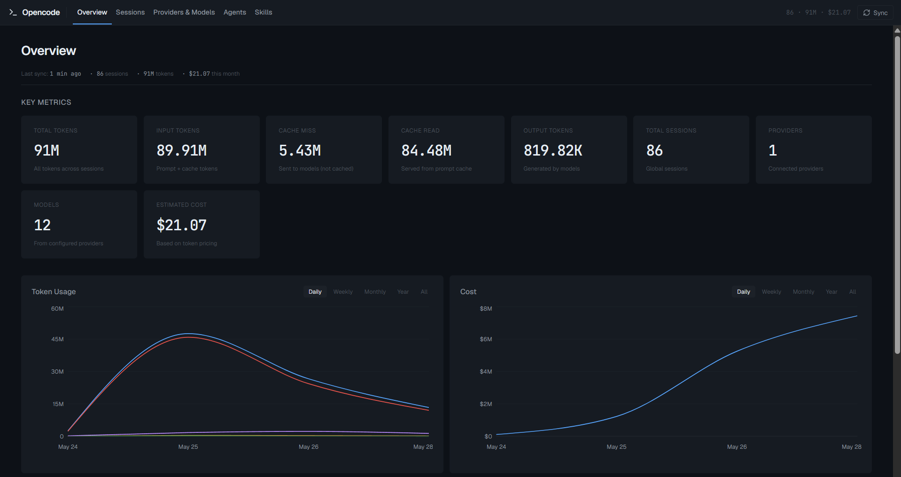
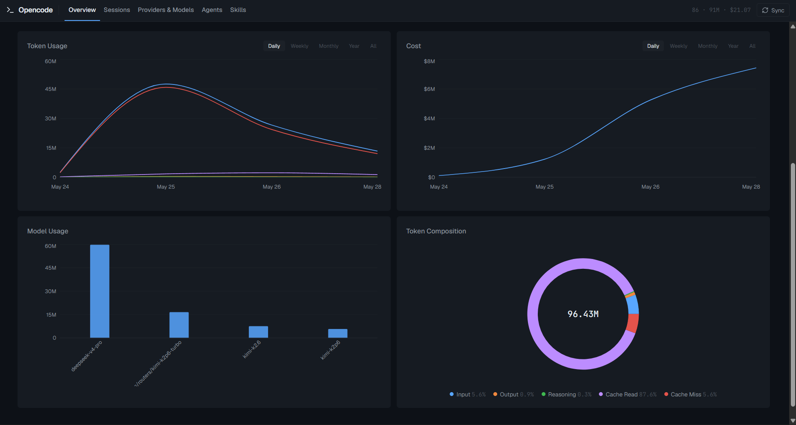

# Opencode Dashboard

A client-side dashboard for visualizing your [opencode](https://github.com/opencode-ai/opencode) usage data — sessions, messages, tokens, costs, providers, models, agents, and skills.

> **All data is local.** No backend server. No cloud upload. Your data stays on your machine.

<p align="center">
  
</p>

<p align="center">
  
</p>

---

## Features

- **Overview** — Total sessions, tokens, costs, and most-used model at a glance
- **Sessions** — Browse all sessions, filter by project or agent, view details
- **Token Usage** — Interactive charts by model, provider, project, and time (day/week/month/year)
- **Providers & Models** — View configured providers, model pricing, and capabilities
- **Agents** — List and inspect your custom opencode agents with usage stats
- **Skills** — Discover installed skills from your global opencode directories
- **One-click Sync** — Pull fresh data from your local opencode SQLite database

---

## Tech Stack

- [React](https://react.dev/) 19 + [TypeScript](https://www.typescriptlang.org/) 5
- [Vite](https://vitejs.dev/) 8
- [Recharts](https://recharts.org/) for data visualization
- [Motion](https://motion.dev/) for page transitions
- [Zustand](https://github.com/pmndrs/zustand) for state management
- [Tailwind CSS](https://tailwindcss.com/) (via Vite plugin)

---

## Prerequisites

- [Node.js](https://nodejs.org/) 18+ (LTS recommended)
- [npm](https://www.npmjs.com/) (or pnpm / yarn)
- **opencode installed locally** — the dashboard reads from your local opencode data files

---

## Installation

```bash
git clone https://github.com/your-username/opencode-dashboard.git
cd opencode-dashboard
npm install
```

### First-time setup

Before running the dashboard, you must generate the static JSON data files from your local opencode database:

```bash
npm run sync
```

This creates `public/data/*.json` — all the data the dashboard needs.  
> ⚠️ This folder is `.gitignore`d and **must never be committed** — it contains your personal data and API keys.

Then start the dev server:

```bash
npm run dev
```

Open [http://localhost:5173](http://localhost:5173) in your browser.

---

## Data Architecture

The dashboard is **100% client-side**. All data comes from static JSON files in `public/data/`:

| File | Source |
|------|--------|
| `sessions.json` | `opencode.db` (SQLite) |
| `messages.json` | `opencode.db` (SQLite) |
| `parts.json` | `opencode.db` (SQLite) |
| `projects.json` | `opencode.db` (SQLite) |
| `overview.json` | Computed aggregates from sessions |
| `token-usage.json` | Computed aggregates from sessions |
| `providers.json` | `auth.json` (local + config fallback) |
| `models.json` | `cache/models.json` |
| `agents.json` | `config/agents/*.md` |
| `skills.json` | Scanned `SKILL.md` files in global directories |

The sync script auto-detects opencode paths on Windows/macOS/Linux. Override with:

```bash
npm run sync -- --local <path> --cache <path> --config <path>
# or
OPENCODE_DATA_PATH=/path/to/opencode npm run sync
```

---

## Available Scripts

| Command | Description |
|---------|-------------|
| `npm run dev` | Start Vite dev server with live reload + sync API endpoint |
| `npm run build` | Type-check and build for production |
| `npm run preview` | Preview the production build locally |
| `npm run sync` | Export opencode data → `public/data/*.json` |
| `npm run lint` | Run ESLint across the entire project |

> **Build order matters:** `tsc -b` runs first; type errors block the Vite build.

---

## Project Structure

```
├── public/
│   ├── data/              # Generated JSON files (ignored by git)
│   └── fonts/             # Geist & JetBrains Mono
├── scripts/
│   └── sync-opencode-data.js   # Data export script
├── src/
│   ├── components/        # Reusable UI components
│   ├── pages/             # Route-level pages
│   ├── stores/            # Zustand stores
│   ├── utils/             # Data loaders, cost calculator, helpers
│   └── types/             # TypeScript type definitions
├── vite.config.ts         # Vite config + dev-only /api/sync endpoint
├── tsconfig.json          # TypeScript solution config
└── eslint.config.js      # ESLint flat config
```

---

## Security & Privacy

- **No data leaves your machine.** The dashboard is a static client-side app.
- **Never commit `public/data/`** — it contains your personal sessions, messages, and API keys.
- The sync script reads from your local opencode files only.
- Production builds serve static files only; the `/api/sync` endpoint works only in dev mode.

---

## Contributing

Contributions are welcome! Please open an issue or pull request.

1. Fork the repository
2. Create a feature branch (`git checkout -b feat/my-feature`)
3. Make your changes
4. Ensure `npm run lint` and `npm run build` pass
5. Submit a pull request

---

## License

MIT License — see [LICENSE](./LICENSE) for details.

---

## Acknowledgments

Built for the [opencode](https://github.com/opencode-ai/opencode) community.
